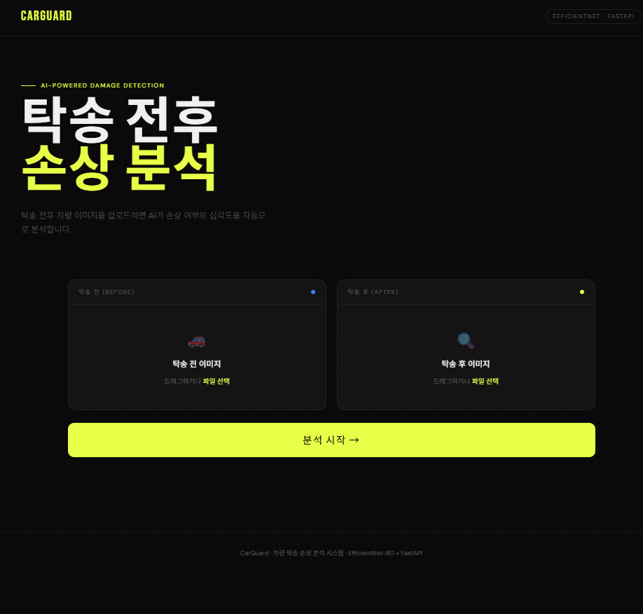
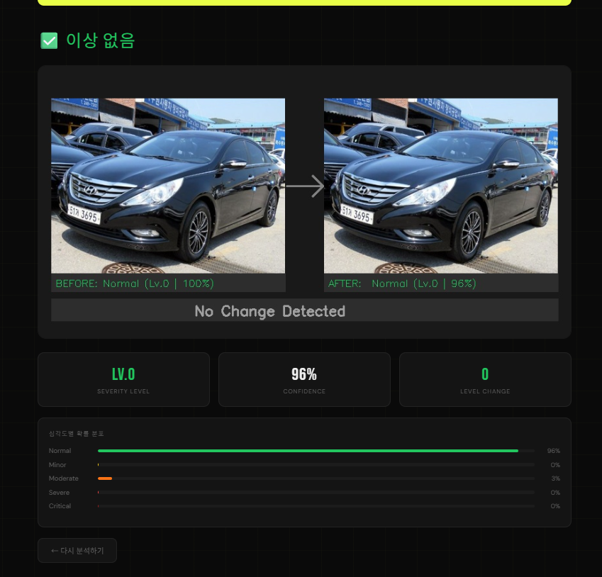
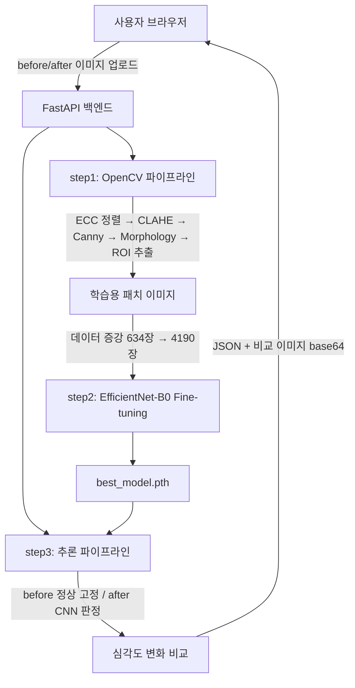

<div align="center">

# 🚗 CarGuard
### AI-Powered Vehicle Damage Detection System

**"탁송 분쟁의 핵심은 '언제 생긴 흠집인가'입니다. 이 질문을 AI로 풀었습니다."**

[](https://python.org)
[](https://pytorch.org)
[](https://fastapi.tiangolo.com)
[](https://opencv.org)
[](https://aws.amazon.com)

### 🌐 [라이브 데모 바로가기 →](http://3.27.11.142:8000)

</div>

---

## 📸 서비스 화면

<table>
  <tr>
    <td align="center" width="50%">
      
      <br/><sub><b>탁송 전·후 이미지 업로드</b></sub>
    </td>
    <td align="center" width="50%">
      
      <br/><sub><b>BEFORE → AFTER 비교 + 신뢰도 96% + 심각도 분포</b></sub>
    </td>
  </tr>
</table>

> 📁 `docs/screenshots/` 폴더에 `main.png` · `result.png` 순서로 이미지를 추가하면 자동 표시됩니다.

---

## 🎯 핵심 차별화 포인트

| | 일반 접근 | **이 프로젝트** |
|---|---|---|
| **데이터 부족 문제** | 소규모 데이터로 학습 포기 | 634장 → **4,190장** 증강으로 극복 |
| **라벨링 기준** | 기존 데이터셋 그대로 사용 | **0~4단계 심각도 기준 직접 설계** |
| **이미지 전처리** | 원본 이미지 그대로 입력 | ECC 정렬 → CLAHE → Canny → ROI 추출 **OpenCV 파이프라인 직접 구현** |
| **서비스 수준** | 모델 학습으로 완료 | **FastAPI 서버 + AWS EC2 실배포** |
| **결과 제공** | 라벨만 반환 | BEFORE/AFTER 비교 이미지 + 신뢰도 + **심각도별 확률 분포 시각화** |

---

## 🏗️ 시스템 아키텍처



---

## 🧠 핵심 구현

### OpenCV 전처리 파이프라인

단순히 이미지를 모델에 넣은 것이 아니라, 탁송 전·후 촬영 환경 차이(각도·조명)를 보정하는 전처리 파이프라인을 직접 설계했습니다.

```
before + after 이미지
    │
    ├── ① ECC 정렬          촬영 각도 차이 자동 보정
    ├── ② CLAHE 명암 보정   조명 차이 제거
    ├── ③ Canny 엣지 탐지   흠집 영역 마스크 생성
    ├── ④ Morphology 필터   노이즈 제거
    └── ⑤ ROI 패치 추출     흠집 영역 크롭 → CNN 입력
```

### 심각도 라벨링 체계 (직접 설계)

| 단계 | 수준 | 기준 |
|:---:|------|------|
| **Lv.0** | 정상 | 신규 흠집 없음 |
| **Lv.1** | 경미 | 얕은 스크래치, 멀리서 잘 안 보임 |
| **Lv.2** | 보통 | 육안으로 명확, 도장 손상, 부분 도색 가능 |
| **Lv.3** | 심각 | 넓거나 깊음, 찌그러짐, 수리 필요 |
| **Lv.4** | 매우 심각 | 구조적 손상 수준, 즉시 수리·교체 필요 |

### 모델 학습

- **EfficientNet-B0** (ImageNet pretrained) — 마지막 분류기만 교체하여 Fine-tuning
- 클래스 불균형 대응: CrossEntropyLoss 클래스 가중치 적용
- AdamW + CosineAnnealingLR 스케줄러 + Early Stopping (patience=5)
- **val accuracy 64%** (원본 126쌍 소규모 데이터 기준)

---

## 🌐 API 명세

| Method | Endpoint | 설명 |
|--------|----------|------|
| `POST` | `/analyze` | before/after 이미지 → 심각도 분석 결과 반환 |
| `GET` | `/health` | 서버 상태 확인 |
| `GET` | `/` | 프론트엔드 서빙 |

**응답 예시**
```json
{
  "before": { "severity": 0, "label": "Normal", "confidence": 1.0 },
  "after":  { "severity": 4, "label": "Critical", "confidence": 0.91 },
  "damage_detected": true,
  "severity_change": 4,
  "result_image": "<base64 encoded image>"
}
```

---

## 🔥 Trouble Shooting

### 소규모 데이터(126쌍) 한계 극복

**문제**: 탁송 차량 이미지 특성상 수집 가능한 데이터가 126쌍(756장)에 불과  
**해결**: 도메인에 적합한 증강 기법 5종 적용 — 좌우반전 / 상하반전 / 회전(±15°) / 밝기조절 / 가우시안블러  
**결과**: 634장 → **4,190장** (+561%) 확보  
**학습**: 무작정 많이 증강하는 것이 아니라 차량 이미지 특성(좌우 대칭 가능, 상하 반전 불가 등)을 고려한 증강 전략이 필요함

---

### 팀 프로젝트 → 독립 서비스 고도화

**문제**: 팀 프로젝트는 모델 학습까지만 완료, 실제 서비스로 사용하기 어려운 구조  
**해결**: FastAPI 서버 설계 + HTML/CSS/JS 프론트엔드 직접 구현 + AWS EC2 배포  
**결과**: 브라우저에서 이미지 업로드 → 실시간 분석 결과 확인까지 **end-to-end 서비스 완성**  
**학습**: 모델 성능만큼 "사용자가 실제로 쓸 수 있는 형태"로 만드는 것이 중요함

---

## ⚠️ 한계 및 개선 방향

| 한계 | 원인 | 개선 방향 |
|------|------|-----------|
| val accuracy 64% | 126쌍 소규모 데이터 한계 | CarDD 등 공개 데이터셋 추가 결합 |
| 심각 케이스 F1 낮음 | Lv.3·4 데이터 절대 부족 | 추가 수집 + Focal Loss 적용 |
| 흠집 위치 시각화 미구현 | 분류 모델 구조 한계 | GradCAM 또는 바운딩 박스 파이프라인 통합 예정 |

> 한계를 솔직하게 인식하고, 개선 방향을 구체적으로 설계했습니다.

---

## 📁 프로젝트 구조

```
vehicle-damage-detection/
├── main.py                  # FastAPI 서버
├── index.html               # 프론트엔드
├── labels.csv               # 심각도 라벨 (car_id, score)
├── step1_prepare_data.py    # OpenCV 전처리 파이프라인 + 데이터 증강
├── step2_train_cnn.py       # EfficientNet-B0 Fine-tuning
├── step3_pipeline.py        # before/after 비교 추론
├── model/
│   └── best_model.pth       # 학습된 CNN 모델
└── README.md
```

---

## 🚀 실행 방법

> 💡 바로 써보고 싶다면 위의 [라이브 데모](http://3.27.11.142:8000)를 이용하세요.

```bash
git clone https://github.com/rkdwltn1211/vehicle-damage-detection.git
cd vehicle-damage-detection

python -m venv venv
source venv/bin/activate  # Windows: venv\Scripts\activate

pip install fastapi uvicorn torch torchvision opencv-python-headless \
            pillow numpy python-multipart scikit-learn pandas matplotlib

uvicorn main:app --host 0.0.0.0 --port 8000
# → http://localhost:8000
```

---

## 🔗 관련 링크

| | 링크 |
|---|---|
| 🌐 라이브 데모 | [http://3.27.11.142:8000](http://3.27.11.142:8000) |
| 👥 원본 팀 프로젝트 | [vehicle-delivery-ai-system](https://github.com/rkdwltn1211/vehicle-delivery-ai-system) |
| 👤 개발자 GitHub | [rkdwltn1211](https://github.com/rkdwltn1211) |

---

<div align="center">

**📬 문의는 GitHub Issues 또는 [rkdwl3264@naver.com](mailto:rkdwl3264@naver.com)으로 남겨주세요**

</div>
